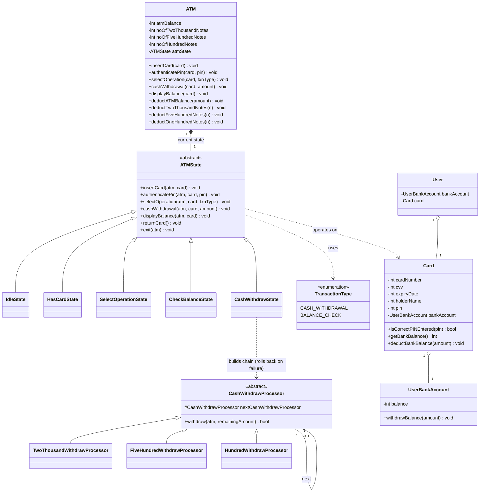

# ATM — Class Diagram

Reflects the fixed/enhanced design: State pattern for the ATM lifecycle, Chain of Responsibility for note dispensing.

```mermaid
classDiagram
    direction TB

    class ATM {
      -int atmBalance
      -int noOfTwoThousandNotes
      -int noOfFiveHundredNotes
      -int noOfHundredNotes
      -ATMState atmState
      +insertCard(card) void
      +authenticatePin(card, pin) void
      +selectOperation(card, txnType) void
      +cashWithdrawal(card, amount) void
      +displayBalance(card) void
      +deductATMBalance(amount) void
      +deductTwoThousandNotes(n) void
      +deductFiveHundredNotes(n) void
      +deductOneHundredNotes(n) void
    }

    class ATMState {
      <<abstract>>
      +insertCard(atm, card) void
      +authenticatePin(atm, card, pin) void
      +selectOperation(atm, card, txnType) void
      +cashWithdrawal(atm, card, amount) void
      +displayBalance(atm, card) void
      +returnCard() void
      +exit(atm) void
    }

    class IdleState
    class HasCardState
    class SelectOperationState
    class CheckBalanceState
    class CashWithdrawState

    ATMState <|-- IdleState
    ATMState <|-- HasCardState
    ATMState <|-- SelectOperationState
    ATMState <|-- CheckBalanceState
    ATMState <|-- CashWithdrawState

    ATM "1" *-- "1" ATMState : current state
    ATMState ..> TransactionType : uses

    class TransactionType {
      <<enumeration>>
      CASH_WITHDRAWAL
      BALANCE_CHECK
    }

    class Card {
      -int cardNumber
      -int cvv
      -int expiryDate
      -int holderName
      -int pin
      -UserBankAccount bankAccount
      +isCorrectPINEntered(pin) bool
      +getBankBalance() int
      +deductBankBalance(amount) void
    }

    class UserBankAccount {
      -int balance
      +withdrawBalance(amount) void
    }

    class User {
      -UserBankAccount bankAccount
      -Card card
    }

    User "1" o-- "1" Card
    Card "1" o-- "1" UserBankAccount
    ATMState ..> Card : operates on

    class CashWithdrawProcessor {
      <<abstract>>
      #CashWithdrawProcessor nextCashWithdrawProcessor
      +withdraw(atm, remainingAmount) bool
    }

    class TwoThousandWithdrawProcessor
    class FiveHundredWithdrawProcessor
    class HundredWithdrawProcessor

    CashWithdrawProcessor <|-- TwoThousandWithdrawProcessor
    CashWithdrawProcessor <|-- FiveHundredWithdrawProcessor
    CashWithdrawProcessor <|-- HundredWithdrawProcessor
    CashWithdrawProcessor "1" --> "0..1" CashWithdrawProcessor : next

    CashWithdrawState ..> CashWithdrawProcessor : builds chain (rolls back on failure)
```
